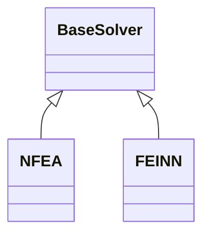
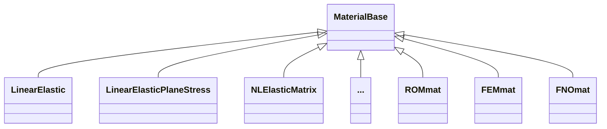
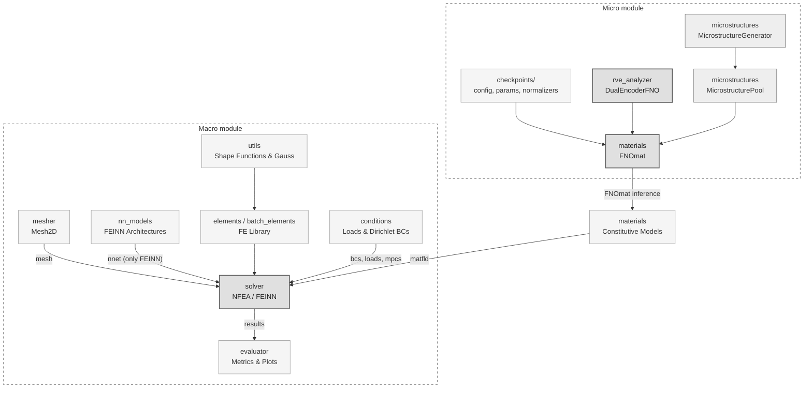

# feinn_project
CEIA FIUBA - Final Project - Finite Element-Integrated Neural Network framework

## About this project

This repository explores the application of deep learning techniques for the resolution of solid mechanics problems.

It is divided in two stages:

1. The FEINN framework integrates finite element methods with neural networks to create a hybrid approach for solving partial differential equations (PDEs) and other computationally intensive problems. This project aims to leverage the strengths of FEM for spatial discretization and neural networks for adaptive learning, enabling efficient and accurate solutions for engineering and physics-based applications.

1. Development of a data-driven Fourier Neural Operator (FNO) to be used as a surrogate constitutive material model for multiscale simulations. Training data is generated from finite element simulations.

This project was developed as part of the CEIA (Curso de Especialización en Inteligencia Artificial) at FIUBA (Facultad de Ingeniería, Universidad de Buenos Aires).

## Project structure

```
├── notebooks/
│   ├── meshes/             # FE meshes (.med) for macroscopic simulations
│   ├── FEINN_example<N>/   # FEINN benchmark cases (N = 1..4)
│   ├── RVEs/               # RVE data generation and FNO training runs
│   └── MS-FNO/             # Multiscale FNO benchmark cases
├── src/                    # Source code
├── setup.sh                # Environment setup script
└── pyproject.toml          # Project dependencies
```

## Prerequisites

- Python > 3.11
- Poetry 2.1.4

## Running the project

1. Clone the repository on your local machine.
1. Set the target device for PyTorch (`cuda` or `cpu`) in `setup.sh`. Default: `cuda`.
1. Run the setup script in a bash console (e.g. Git Bash):

    ```bash
    ./setup.sh
    ```

    Installs all dependencies via Poetry and sets up `PYTHONPATH` in the virtual environment.

1. Activate the environment:

    ```bash
    poetry env activate
    ```

1. You are ready to run the notebooks and make your own simulations.

## Code implementation

### Macro module

- [src/batch_elements.py](src/batch_elements.py): GPU-vectorized finite element library.
- [src/conditions.py](src/conditions.py): Boundary conditions and external loads classes.
- [src/elements.py](src/elements.py): Single-element finite element library.
- [src/mesher.py](src/mesher.py): Finite element mesh manager classes. It contains:
    - `Mesh2D`: Base class storing nodes, element types and connectivity, and node/element groups. Supports import from Salome `.med` files.
    - `UniformQuadMesh2D`: Inherits from `Mesh2D`. Generates structured quadrilateral meshes over rectangular domains (Q4, Q8, Q9).
- [src/nn_models.py](src/nn_models.py): Neural network architecture library for use in FEINN models.
- [src/trainer.py](src/trainer.py): Training utilities for FEINN models, including self-adaptive loss weighting.
- [src/utils.py](src/utils.py): Shape functions and Gauss quadrature utilities for finite element analysis.
- [src/evaluator.py](src/evaluator.py): Metrics and model comparison tools.
- [src/solver.py](src/solver.py): Core solvers for 2D solid mechanics. It contains:
    - `BaseSolver`: Abstract base class with shared assembly and boundary condition logic.
    - `NFEA`: Non-linear finite element solver.
    - `FEINN`: Finite Element-Integrated Neural Network solver.



### Micro module

- [src/data_generator.py](src/data_generator.py): Strain path generation for RVE training data.
- [src/microstructures.py](src/microstructures.py): RVE microstructure generation. It contains:
    - `MicrostructureGenerator`: Abstract base class for RVE microstructure generators. Defines the interface for generating phase tensors and masks at a given resolution. Concrete subclasses: `CentralFiber`, `CentralCornerFiber`, `RandomBlocks`, `Layered`.
    - `MicrostructurePool`: Precomputes a pool of microstructures indexed by fiber volume fraction (`fhard`), used for efficient batch sampling during `FNOmat` inference.
- [src/rve_analyzer.py](src/rve_analyzer.py): Full FNO surrogate model pipeline, from data loading to evaluation:
    - `RVEDataset`: PyTorch dataset for HDF5 training data, with in-memory and lazy-loading modes.
    - `DualEncoderFNO`: Dual-encoder FNO with FiLM conditioning for parallel processing of the spatial microstructure branch and the global macroscopic parameters branch. Generic model.
    - `Trainer`: Training loop for `DualEncoderFNO`.
    - `RVEInferencer`: Runs forward pass with the trained model and returns denormalized predictions.
    - `RVEVisualizer`: Plots and compares predicted vs. reference fields.
    - `EquilibriumLoss`: Enforces linear momentum balance at the RVE level (strong formulation: div(σ) = 0).
    - `HomogenizedLoss`: Loss on volume-averaged (homogenized) stress components.
    - `WeightedVoigtLoss`: Data loss with Voigt-notation weighting for stress components.

        `DualEncoderFNO` model pipeline:

        ```mermaid
        graph LR
            classDef branch fill:#f5f5f5,stroke:#9e9e9e,stroke-width:1px;
            classDef core fill:#e0e0e0,stroke:#616161,stroke-width:2px;

            subgraph SpatialBranch["Local Branch"]
                A["x_local (B, C, H, W)<br>Microstructural field"] --> B["Positional Embedding<br>(optional)"]
                B --> C["Lifting — ChannelMLP"]
            end

            subgraph GlobalBranch["Global Branch"]
                D["x_global (B, n_macro)<br>Macroscopic parameters"] --> E["FiLM MLP<br>gamma, beta"]
            end

            C --> F["FNO Blocks<br>N Fourier layers"]
            E -->|"Affine modulation<br>gamma * x + beta"| F

            F --> G["Projection — ChannelMLP"]
            G --> H["Output (B, C_out, H, W)<br>Local stress fields"]

            class A,B,C,D,E branch;
            class F,G,H core;
        ```

        Classes pipeline:

        ```mermaid
        graph LR
            Loss["Loss functions"] -->|loss| Trainer
            RVEDataset -->|feeds train & val| Trainer
            DualEncoderFNO -->|trained by| Trainer
            DualEncoderFNO -->|loaded by| RVEInferencer
            RVEDataset -->|feeds test| RVEInferencer
            RVEInferencer -->|results to| RVEVisualizer
        ```

        Training workflow:

        ```mermaid
        graph LR
            subgraph Training[" "]
                STRAIN[data_generator<br>Strain Paths]
                MESHES[meshes/<br>RVE geometries]
                STRAIN --> NB_GEN[RVE_data_generation.ipynb<br>FEM solution]
                MESHES --> NB_GEN
                NB_GEN --> NB_PREP[RVE_data_preprocessing.ipynb<br>split, norm stats & master file]
                NB_PREP --> NB_HPO[RVE_FNO_hpo.ipynb<br>HP tuning]
                NB_HPO --> NB_TRAIN[RVE_FNO_training.ipynb<br>Model training]
                NB_TRAIN --> CKPT[Persistency: checkpoints/<br>config, params, normalizers]
            end

            style Training fill:none,stroke:#666,stroke-dasharray:5 5
        ```

### Material module

- [src/materials.py](src/materials.py): Constitutive model library for the macro solver. The central class is:
    - `MaterialBase`: an abstract base class initialized with the number of internal state variables (`n_state`), dtype, and device. It defines two key methods: 
        - `init_state`: allocates the history variable tensor `(nelem, ngp, n_state)` at the start of a simulation.
        - `update_state`: takes the current strain tensor and the previous state as inputs and returns the updated stress, state, and tangent stiffness matrix.

    All material models inherit from `MaterialBase` and expose this common interface to the solver.
    
    This module also acts as the bridge between the macro solver and the micro surrogate: models such as `FEMmat` and `FNOmat` wrap micro-scale computations (full FE or FNO inference) behind the same `update_state` interface, making them interchangeable with any other material model from the solver's perspective.

    Available models:
    - `LinearElastic`, `LinearElasticPlaneStress`: Classical linear elastic models (plane strain and plane stress).
    - `NLElasticMatrix`: Non-linear elastic model for polymeric matrices.
    - `ROMmat`: Rule-of-Mixtures homogenization (Voigt / Reuss bounds).
    - `FEMmat`: FE-based micro model evaluated at each integration point.
    - `FNOmat`: FNO-based surrogate. Evaluates homogenized stress and tangent stiffness by querying the trained `DualEncoderFNO`.



## Component Interaction Flow



## Roadmap

### 1st Part: Finite Element integrated Neural Network for Solid Mechanics
- ✅ Torch implementation of 2D Non-linear Finite Element code.
- ✅ Neural network integration with FEM.
- ✅ Benchmark cases.

**BONUS**
- ⬜ Surrogate NN constitutive model implementation.
- ⬜ FEINN for inverse problems.

### 2nd Part: FNO for Multi-scale in Solid Mechanics
- ✅ Strain history generation using Gaussian Process with RBF kernel.
- ✅ Synthetic data generation via FEM.
- ✅ FNO surrogate model implementation.
- ✅ Integration of FNO surrogate model into macro solver.
- ✅ Benchmark cases.
